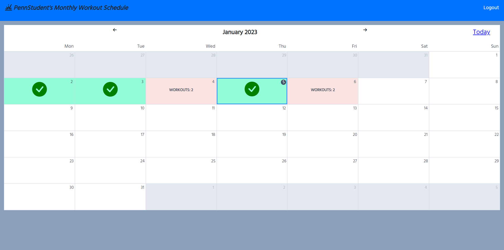

# Workout Tracker

## Description

Workout Tracker is a web app to help schedule and track workouts in order to meet users’ fitness goals. A lot of us struggle to keep up with exercising – especially when busy with work, school, or even a coding bootcamp! A fitness app was personally appealing and useful to all of us, and presented opportunities to try out diverse layouts and functionality while exploring and meeting acceptance criteria. This project was built using node.js, express.js, express-handlebars, mysql, day.js, Chart.js and sequelize. We utilized data from the Api Ninjas excercise api.

## Table of Contents
 - [usage](#usage)
 - [credits](#credits)
 - [license](#license)

## Usage
Heroku Link: https://rocky-woodland-73548.herokuapp.com/login

Screenshot: 

## Credits

Contributors: 
 Avani Muchhala, Colin Deery, Emma Wiggans and Layne Nigro.
 https://stackoverflow.com/questions/27322881/how-can-i-create-a-simple-page-vertical-scroll-bar-without-using-jquery AdamSchuld
 https://medium.com/@m.rybczonek/how-to-make-a-monthly-calendar-with-real-data-80b2e560abec Mateusz Rybczonek

## License

This project is licensed under the MIT license. https://choosealicense.com/licenses/mit/
